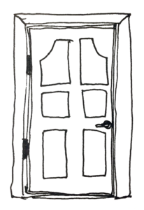
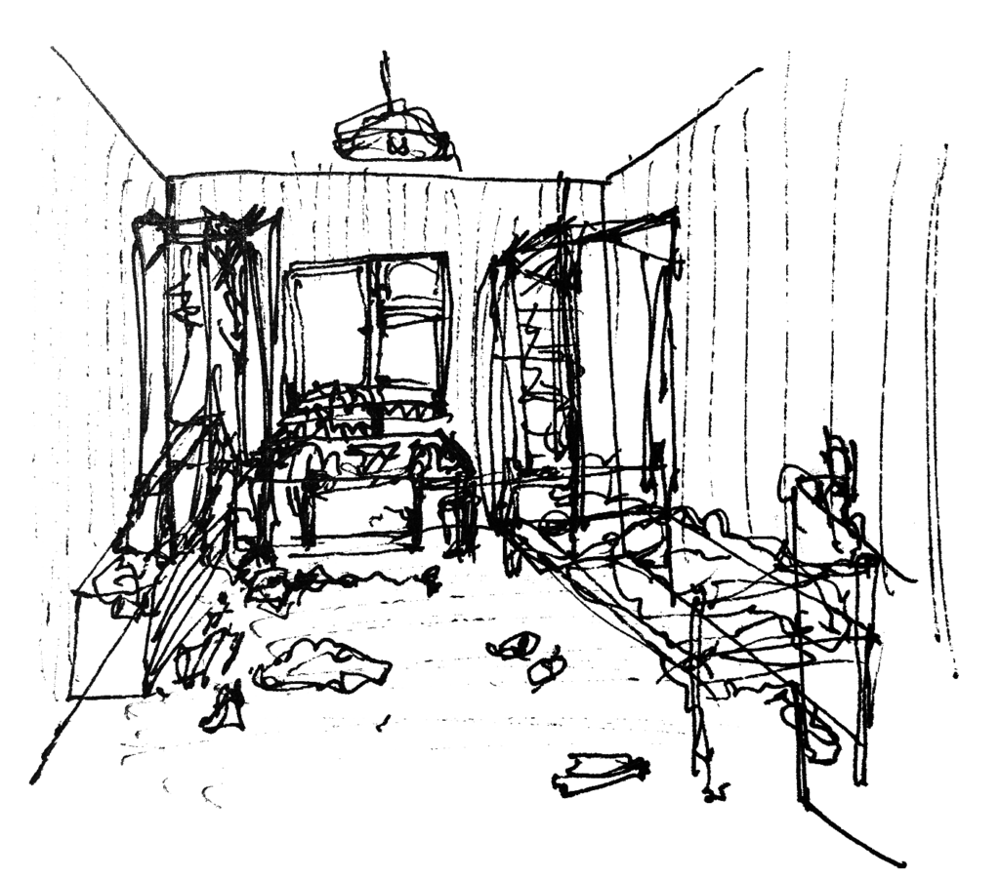
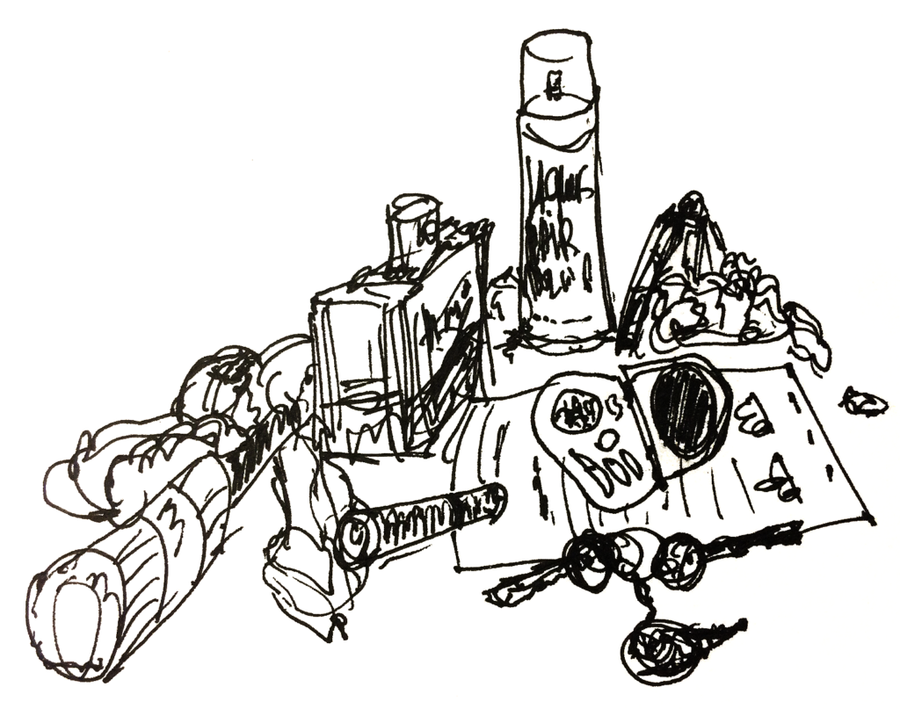
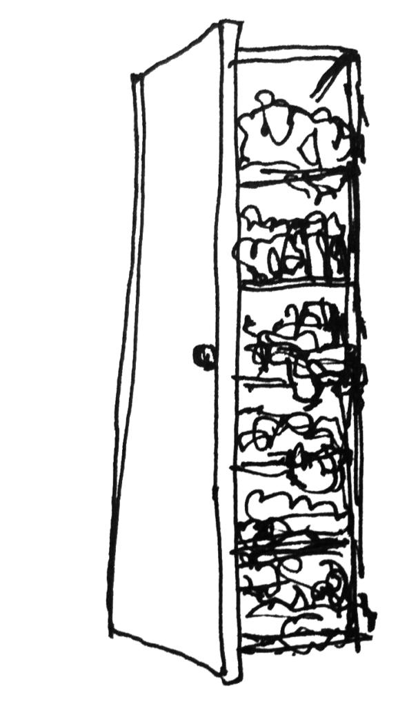
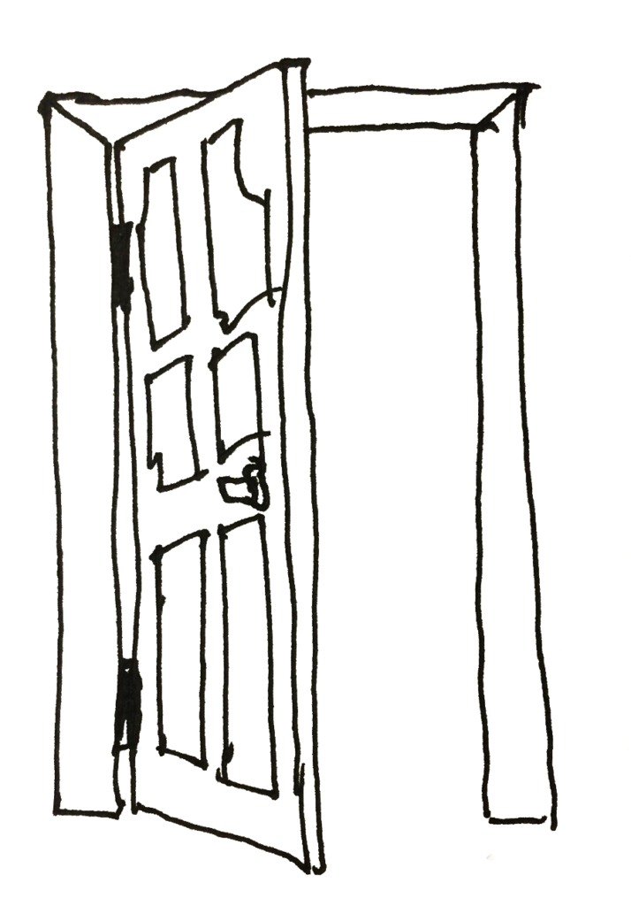
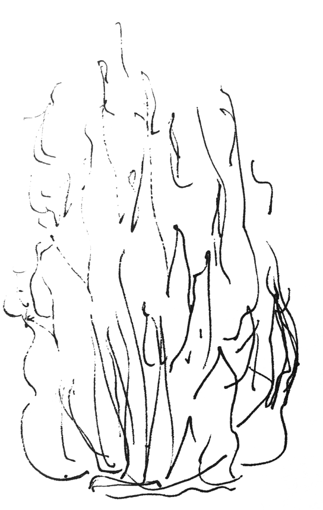

Однажды я зашел к сестре в комнату и сказал:

— Боже, какой у тебя тут беспорядок!

Она повернулась, отвлекшись от какой-то игры на экране, повернула в мою сторону голову и, бросив на меня гневный взгляд, процедила сквозь зубы:

— Ты пришел сюда меня взбесить? Зачем ты меня бесишь, тебе это приносит удовольствие? Или ты так самоутверждаешься за мой счет? Или тебе что, больше делать нечего чтоли?

Я ничего не ответил и ушел, плотно закрыв за собой дверь.

Шли дни и однажды я снова заглянул к ней в комнату и, увидев, что в комнате ничего не поменялось, сказал:

— Боже, какой же у тебя беспорядок тут в комнате!

Сестра огляделась, скользнув по горе одежды на кресле, разбросанной косметике и рассыпанному по кровати содержимому сумки, подняла на меня глаза, полные гнева, и громко сказала:

— Ну что тебе надо? Это не твое дело! Моя комната, что хочу, то и делаю! Не лезь в мою жизнь!

Я ничего не ответил и, вздохнув, вышел и закрыл дверь.

Я долго не заходил к ней, стараясь не нарушать ее столь хрупкую гармонию личной жизни, однако однажды меня опять занесло в её в комнату. И, будучи не в силах промолчать, повторил уже избитую мысль:

— Вот это бардак!

Сестра вскочила, схватила гору одежды со спинки кресла, распахнула шкаф и, грубо затолкав все внутрь, хлопнула дверцей. Сгребла косметику в угол стола, затолкала в сумку ее содержимое с кровати и вскрикнула:

— Ну что, доволен? Ты этого добивался? Добился? Отстань от меня!

Я тут же отстал и молча ушел из комнаты, аккуратно закрыв за собой дверь.

Одним воскресным утром я увидел, что дверь в комнату сестры распахнута, а она ходит с гордым видом по квартире, нося то тряпку, то гору ложек и стаканов с блюдцами, накопившихся на столе и за монитором.

— Смотри, я убираюсь! Я пыль протерла, одежду повесила в шкаф. Сейчас пылесосить буду.

— Похвально, — ответил ей я без особого участия.

— Ты не рад, что ли, что я тут корячусь и порядок навожу? Тебя же тут больше всех бесит беспорядок! Вот радуйся давай, радуйся!

Я ничего не ответил и пошел пройтись на улицу.

Вернувшись, я обнаружил, что дверь в комнату сестры открыта, а там она сидит в чистом кресле, за вполне аккуратно обставленным столом с чашечкой чая и печеньем и одухотворенно рассматривающей результаты уборки.

— Неплохо. А чего косметику-то не сложила аккуратно? Удобно, когда она там в углу горой свалена? А подоконник чего такой пыльный, не заметила?

Её глаза вспыхнули гневом. 

— Ты обнаглел? Я весь день тут убиралась, смотри, как на столе чисто! Одежда вся развешана, постель застелена, я даже пропылесосила тут сама!

Я не стал ничего отвечать, повернулся и стал было уходить, но не тут-то было. Сестра разгоралась как костер на ветру.

— И вообще, ты кто такой, чтобы меня тут учить? Ты сам-то на свою комнату посмотри! У тебя самого одежда вечно на кресле свалена, а стол весь проводами завален! Ты одежду хоть раз вообще гладил? Окно у себя в комнате помыл и теперь всех учить можно?!

Я уже сидел в своей комнате в кресле, а сестра нависала надо мной и громко причитала, перечисляя уже мои детские ошибки и глупости десятилетней и более давности, попутно поливая меня оскорблениями. Еще 40 секунд и она, продолжая что-то кричать, хлопнула сначала дверью моей комнаты, а потом с еще большей силой закрыла и свою.

Долго после того мы не могли разговаривать. Она даже отворачивала глаза, избегая встречи взглядами. Но со временем гнев прошел.

Теперь я старался не заходить к ней и не заглядывать через изредка открывающуюся дверь. Но однажды я все-таки зашел к ней в комнату и, внимательно оглядев царивший там порядок, сказал:

— Слушай, тут все так чисто и так аккуратно расставлено по местам, все так подобрано и гармонично. Это больше похоже на выставочный павильон в каком-нибудь мебельном магазине, чем на комнату настоящего живого человека. Где же тут ты?

----

Денис Старов, май 2011

 

## Где же тут ты?

